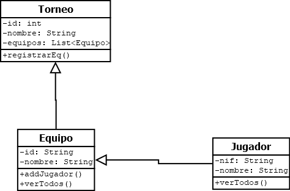

# Sistema de Gestión de Torneos eSports

## Autor
Sandra Marcos García
Perfil de GitHub: https://github.com/smarcos90

## Descripción del Proyecto
Link al repositorio del Proyecto: https://github.com/smarcos90/torneo-esports-uml.git

Diseño y desarrollo de un sistema de gestión de torneos de eSports, aplicando Programación
Orientada a Objetos (POO) y utilizando diagramas UML para modelar su estructura y funcionalidad.

## Diagramas UML
### Diagrama de casos de uso

### Diagrama de Clases

## Estructura del Proyecto
torneo-esports-uml/  
├── src/  
│ ├── es/empresa/torneo/  
│ │ ├── modelo/  
│ │ ├── control/  
│ │ ├── vista/  
│ │ ├── Main.java  
├── diagrams/  
│ ├── casos-uso.png  
│ ├── clases.png  
├── README.md  
├── .gitignore

## Instalación y ejecución
1. Clonar el repositorio:
`git clone https://github.com/smarcos90/torneo-esports-uml.git`

2. Compilar y ejecutar el proyecto:
`cd src javac es/empresa/torneo/Main.java java es.empresa.torneo.Main`

## Justificación del diseño
### Casos de uso
El administrador tiene completo control del sistema, pudiendo realizar las tareas de registro y consulta del listado de equipos y jugadores. 
Al añadir un equipo obliga (include) a registrar jugadores dentro del equipo. Sin embargo, la consultar el listado de equipos no es obligatorio la consulta de jugadores (extends).

### Diagrama de clases
El diseño se ha basado en los principios de encapsulamiento, modularidad y relaciones naturales entre las entidades que intervienen en el sistema.

En el caso de torneo, se configura como la relación principal. Contiene una lista de objetos Equipo y el método registrarEquipo. Se identifica a través de un id único.

La entidad equipo está compuesta por el nombre del equipo y un identificador único. Los métodos son para añadir jugadores al equipo y ver todos los equipos que existen en la entidad.

Por último, la entidad jugadores representa a cada participante del torneo con su nombre y su número de nif para ser identificados correctamente.

## Conclusiones
Mediante el diseño y desarrollo de proyectos a través del diagrama de clases y casos de uso se pretende representar la estructura y funcionamiento de un sistema. Nos ayuda a planificar la programación del software y a priorizar sus funcionalidades mientras identificamos las interacciones que los usuarios tendrán con este sistema.